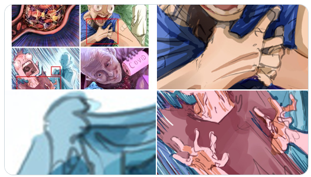

# GPrime85Bot

This is a bot that tweets highlighted images on a schedule. 
The images are annotated with 5px red (255, 0, 0) rectangles. 
The bot will post a tweet including the original picture and crops of the highlighted areas.
Works with a maximum of three highlighted areas, due to Twitter limitations.
The detection algorithm is very simple, it mainly just looks for two horizontal red lines to mark the dimensions of the rect.
Thus, it won't work properly with pictures that contain large regions of pure red, though this is uncommon in photos and artwork anyway.

Annotated images should be placed in `data/img` and given a filename that includes a number, indicating their position in the sequence.
The bot will post every image in the list once, then pick a random image for all future posts until more images are added,
at which point they will be posted in sequence.

State is persisted within `data/state.pkl`, which is just a binary pickled object representing an instance of the BotState class. Delete it to reset.

This bot was originally created to demonstrate George Alexopoulos's inability to draw hands even after thousands of comics worth of practice.

# Setup
1. Install Python 3.10 (Conda works fine) and [pipenv](https://pipenv.pypa.io/en/latest/)
2. `pipenv install`
3. Copy `config.example.cfg` to `config.cfg` and add your Twitter API keys. Note that you will need "elevated" access as media uploading is only available in the 1.1 version of the API.
4. `bash start.sh`
